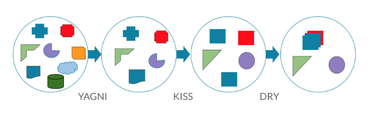

# Frontend coding rules

В данном `Readme` и папке `./examples` описан набор правил по стилю кода и архитектуре `Angular` для проекта.

## Содержание

- [Общее](#common)
- [Файлы](#files)
- [Структура проекта](#structure)
- [Композиция](#composition)
- [Интерфейсы и типы](#interfaces)
- [Форматирование](#formatting)
- [Lint](#Lint)
- [Git](#git)
- [TypeScript](#TypeScript)
- [Общие алгоритмы JavaScript](#javascript)
- [Angular](#Angular)
  - [Мокируем сервисы](#mocking)
  - [Template](#Template)
- [RxJs](#RxJs)
- [Архитектура](#architecture)
- [Комментарии](#comments)
- [CSS Стили](#css)
- [Redux Store ( NGXS )](#ReduxStoreNGXS)
- [Formly](#formly)

## <a name="common"></a>Общее
Программирование - уже давным давно устаявшаеся сфера, поэтому вполне закономерно появление в этой сфере
так называемых паттернов/принципов проектирования и программирования. 
Эти принципы являются достаточно общими и их можно применить ко всем языкам программирования, а не только к разработке на Angular, который в свою очередь использует язык TypeScript.
Паттерны и принципы разработки имеют свои названия, и чтобы их легче запомнить программисты придумали сокращения и аббревиатуры, далее рассмотрим самые популярные:

- **YAGNI** => *You Aren’t Gonna Need It* => Вам это не понадобится. Удаляйте лишнее. Если блок кода не используется - его просто нужно удалить. Не стоит перегружать код проекта "мертвыми" кусками кода.


- **KISS** => *Keep It Stupid & Simple* => Код должен быть максимально простой и понятный. Настолько простой и понятный, что в эту аббревиатуру вставили словой "ТУПОЙ" (см английский вариант), что подчеркивает значимость простоты - не нужно эквилибристики, не нужно супер "крутых" конструкций языка. Все опытные программисты пишут код без "выгибонов" такой, чтобы его понял джун.


- **DRY** => *Don’t Repeat Yourself* =>  Не повторяйте код. Если один и тот же блок кода используется больше чем один раз - это значит его необходимо выделить в отедьную функцию или метод и **переиспользовать**.


- **BDUF**  => *Big Design Up Front*  => Глобальное проектирование прежде всего. "С самого начала у меня был план и я его придерживался" (с). Получив задачу не стоит сразу садиться программировать. Лучше изначально ПОДУМАТЬ и потратить лишние 10-20 минут на осмысление и высокоуровневое планирование и проектирование. Возможно даже стоит сделать наброски на бумаге в виде схемы. Это в дальнейшем сильно облегчит разработку и сэкономит ваше время, т.к. вы совершите меньше ошибок и будете реже переписывать свой код. 


- **SOC** => *Separation Of Concerns* => Разделение проблем. означает разделение программы на отдельные части. Например, код разделяется на несколько независимых между собой классов, образуя модули. Модули также могут быть разделены на некие подсистемы, используемые уже в пределах конкретного модуля, для которых эти подсистемы определены.


- **APO** => *Avoid Premature Optimization* => Избегайте преждевременной оптимизации. Стоит разработать хороший план и проект, но не стоит релизовывать ВСЕ что вы напридумывали наперед. Другими словами не оптимизируйте код до того, как необходимость этой оптимизации будет **ДОКАЗАНА**. Простой пример – масштабирование. Вы не станете закупать 40 серверов предполагая, что ваш сайт завтра взлетит в топ 10. Вы будете добавлять серверы по мере необходимости и увеличения нагрузки. 


- **Бри́тва О́ккама** => (Пересекается с KISS и YAGNI) - методологический принцип, в кратком виде гласящий: «Не следует привлекать новые сущности без крайней на то необходимости». Не создавайте ненужных сущностей без необходимости. Будьте прагматичны — подумайте, действительно ли нужно создавать новые сущности, поскольку они могут в конечном итоге усложнить вашу кодовую базу.


- **SOLID** [Подробнее тут](https://habr.com/ru/post/413707/)
  - S — Single–Responsibility Principle
  - O — Open–Closed Principle
  - L — Liskov Substitution Principle
  - I — Interface Segregation Principle
  - D — Dependency Inversion Principle


## <a name="files"></a>Файлы

Каждую сущность: класс, интерфейс, перечисление, record создаем в отдельном файле. В одном файле не должно быть два
интерфейса или перечисления См. `./src/app/common`

Для `interface` которые описывают методы `NameExample` создаем файл с расширением `***.interface.ts`

Для `interface` которые описывают данные `NameExample` создаем файл с расширением `***.ts`

Для `dictionary (record)` создаем файл с расширением `***.dictionary.ts`

Для `enum` `NameExample` создаем файл с расширением `***.enum.ts`

Для `class` `NameExample` создаем файл с расширением `***.ts`

Для `type` `NameExample` создаем файл с расширением `***.types.ts`. В одном файле допустимо указывать несколько типов, для сущности или модуля.

## <a name="structure"></a>Структура проекта

Проект разделяется на модули. 
Каждый модуль получает свое название по бизнес сущности, например `user-info`

Файловая структура внутри каждого модуля группируется по следующим папкам:

```
`_components` - компоненты, включая "умные" компоненты
    `_dumb` - глупые компоненты
`_providers` - провайдеры
`_models` - модели модуля (object value интерфейсы, классы)
`_pipes` - пайпы
`_directives` - директивы
`_guards` - гуарды
`_resolvers` - резолверы
`_store` - Redux (если у вас есть ngrx/ngxs)
    `actions` - моедли actions
    `models` - модели стейтов и их дефолтные значения
    `states` - эффекты actions и селекторы
`_constants` - константы
`_services` - сервисы
    `facade` - фасады
    `api` - http сервисы
```
Префикс `_` необходим для "всплытия" шаблонных-служебных папок в проводнике, если в проекте не намечается других папок, тогда можно обойтись без префикса `_`. 
Исключение название папки для тупых компонентов: в названии папки всегда использовать подчеркивания `_dumb`

Именования вложенных модулей (модули внутри модуля) формируются так же по бизнес логике.  
Например внутри `user-info` может быть `user-info-details`.

Имена папок компонентов формируем без префикса `_`, например `accordeon`

Моки для сервисов следует класть рядом с реализацией сервисов.

Пример структуры: см. [project-folder-sturcture](examples/src/app/components/project-folder-sturcture)

```
├───user-info
│   │   user-info.module.ts
│   │
│   ├───user-software
│   ├───_components
│   │   ├───_dumb
│   │   │   └───user-info-details
│   │   │           user-info-details.component.css
│   │   │           user-info-details.component.html
│   │   │           user-info-details.component.spec.ts
│   │   │           user-info-details.component.ts
│   │   │
│   │   └───user-info // "умный" компонент
│   │           user-info.component.css
│   │           user-info.component.html
│   │           user-info.component.spec.ts
│   │           user-info.component.ts
│   │
│   ├───_constants
│   ├───_directives
│   ├───_guards
│   ├───_models
│   ├───_pipes
│   ├───_providers
│   │       uesr-http.provider.ts
│   │       user-info.provider.ts
│   │
│   ├───_resolvers
│   ├───_services
│   │   ├───api
│   │   │       user-http-mock.service.ts
│   │   │       user-http-prod.service.ts
│   │   │       user-http.service.ts
│   │   │
│   │   └───facade
│   │           user-ngxs.facade.ts
│   │           user.facade.ts
│   │
│   └───_store
│       ├───actions
│       ├───models
│       └───states
└───user-story
```

## <a name="composition"></a>Композиция
Проектируйте композицию из компонентов таким образом, чтобы при верстке, в шаблоне, уровень Вложенности компонентов не превышал 5 уровней начиная с уровня страницы. Таким образом 5й уровень вложенности не должен содержать ничего кроме html, т.е. компоненты ангуляр недопустимы на 5м уровне.  
Этого можно добиться, в том числе, благодаря использованию `<ng-content>`.
Исключением (т.е. 6м уровнем) могут быть мелкие визуальные односложные-компоненты типа `button` (выпадающее меню или кастомный select это уже не мелкий и не односложный-компонент)

Пример композиции:
```
├───user-info-page                      // 1й - страница
│   │
│   ├───user-info-widget                // 2й - виджет на странице
│   │   ├───user-info-list              // 3й - список внутри виджета
│   │   │   └───user-info-item          // 4й - один элемент списка внутри виджета
│   │   │       ├───user-info-title     // 5й - заголовок, внутри элемента списка
│   │   │       ├───user-info-accordeon // 5й - аккордеон, внутри элемента списка
│   │   │       ├───user-info-input     // 5й - поле ввода, внутри элемента списка

```

## <a name="interfaces"></a>Интерфейсы и типы

Интерфейсы, которые расширяют логику c помощью методов называем с буквы `I` `IAuthService`

Интерфейсы, которые описывают только данные, а также типы `type`, называем с буквы `T`, например:`TDocuments`

Для `car` описываем его интерфейс `ICar` и кладем его в папку `./models/car.ts`

Если интерфейс или тип используется только для работы с одним компонентом, то не выносим его в отдельный файл.

Если интерфейс или тип используется для работы разных компонентов, сервисов, то выносим его в отдельный файл `./models/something.ts`

PS: Есть мнение, согласно которому не рекомендуется юзать префикс `I` для интерфейсов. Это не так. На самом деле команда, которая контрибьютит проект TS создала свой список правил, которому они следуют в своем проекте. И они даже специально написали это БОЛЬШИМИ буквами: это лишь правило на нашем проекте, в своем проекте вы вольны устанавливать свои правила. [Пруфлинк](https://github.com/Microsoft/TypeScript/wiki/Coding-guidelines). 


## <a name="formatting"></a>Форматирование

Код проекта форматируется с помощью prettier

В `root-папке` проекта создается файл `.prettierrc`. В нем прописываем настройки форматирования. Применяем данный
файл в настройках своей IDE.

В `root-папке` проекта создается файл `.prettierignore`. В указываем пути для которых не будет применяться
форматирование.

Настраиваем IDE так, чтобы при сохранении файла к нему применялось форматирование.

Перед каждым `git push` в репозиторий должно производиться форматирование проекта, чтобы code reviewer видел
отформатированный код, также оно будет производиться в самом репозитории при `merge`

## <a name="Lint"></a>Lint

Ошибки в коде ищутся с помощью `Tslint` или `Eslint` (зависит от версии `Angular`)

Правила устанавливаются с помощью сторонних библиотек, например `rxjs-tslint-rules`.

### <a name="git"></a>Tslint

Подключаем библиотеку с правилами в `tslint.json` свойство `extends`

Правила прописываются в файле `tslint.json` свойство `rules`

Проверка правил запускается командой `ng lint --format prose` или см. `package.json`

Перед `push` в репозиторий cделать проверку правил `Tslint` и пофиксить их, если будут ошибки, то `push` не смержится по
правилам `ci/cd` [в перспективе].

## <a name="files"></a>Git

### CRLF LF

Чтобы на разных ОС windows, linux при команде `git add .` не было ошибок `warning: LF will be replaced by CRLF in`
создаем файл `.gitattributes` с правилом.

`* text=auto eol=lf`

## <a name="TypeScript"></a>TypeScript

Пишем максимально строгий и явный код

Указываем модификаторы доступа на все члены и методы классов, за исключением public (назначается по умолчанию)

Указываем тип данных для каждого свойства, константы, аргумента функции, возвращаемое значение функции, аргумента
функции `rxjs` оператора исключение сложные операторы `combine` и тд.

По максимуму не используем проверку наличия/отсутствия свойства объектов с помощью `?`. Возможно только для
DTO. `private a?: number;`

Не используйте `any` (исключение при работе со сторонними библиотеке, если нет возможности).

Старайтесь максимально использовать `generic`, когда возникает необходимость в передачи типов вместо `any`. Используйте `type union`, если вам в качестве результата требуется один из нескольких типов. 

Избегаейте мутации данных, все свойства классов, интерфейсов делаем `readonly`. Это поможет избежать мутации данных из
компонента потомка у родителя и наоборот. Этот же подход поможет Angular при работе со стратегий `OnPush` для явной идентификации соответствующих свойств.

Добавляйте `Readonly<GenericType>` для массивов объектов, если вы не можете явно установить `readonly` для нужных свойств. 

Плохой пример:
```
    requiremensDTO: IRequirementDTO[] = [];
    const user = Readonly<User>
```

Хороший пример:
```
    requiremensDTO: Readonly<IRequirementDTO>[] = [];
    const user = Readonly<User>
```

Никогда не используем `var`. Используем `let`, если значение переменной изменяется, в противном же случае используем всегда `const`.

Всегда используем строгое равенство `===`

Если член класса точно будет проинициализирован, но при этом он не передается в конструкторе, помечаем его символом `!`, если не известно будет оно или нет указываем `undefined`.

Пример:
```
    @Input() adress: string | undefined = undefined;
    
    public userInfo!: UserInfo
    
    ngOnInit(){
        this.userInfo$.pipe(takeUntil(this.destroy$)).subscribe(userInfo => this.userInfo = userInfo)
    }
```

Если данные точно придут из `store` или `facade` по подписке в `ngOnInit`, указываем `private someData!: SomeData;`

Если неизвестно придут данные или нет `private data: number | undefined`

Не используем названия свойств, как строковое значение, т.к это нарушает принцип `DRY`. Вместо этого стараемся получить их как переменную из `Enum` или специальной функциии

Плохой пример:

```
    <app-info [value]='".pdf"'>
    <app-info [value]='".xls"'>
```
Хороший пример:

```
    // typing 
    enum DocTypes { 
        PDF = '.pdf', 
        XLS = '.xls'
    }

    // controller
    get DOC_TYPES(): typeof DocTypes {
        return DocTypes
    }
    
    // html
    <app-info [value]='DOC_TYPES.PDF'>
```

Названия сущностей НЕ должны начинаться с глаголов, используйте существительные.

Плохой пример:

```
    export interface CreatePoTipInfoModel {
        header: string;
        message: string;
    }
```

Хороший пример:

```
    export interface ProductOwnerTipInfoCreateModel {
        header: string;
        message: string;
    }
```

Когда возникает необходимость сделать массив с перечнем ключей объекта, используйте безопасный метод перечисления `Object.keys`, вместо явного указания вручную.

Плохой пример:

```
    const loadingStatus: StoreStatus | undefined = [
        state.productsList.status,
        state.productsComposition.status,
        state.productsCompositionExtended.status,
        state.softList.status,
        state.softServicesWithoutProducts.status,
        state.listOfSoftAndServices.status,
        state.softComposition.status,
        state.productsWithoutSoftAndServices.status,
    ].find((currSatus: StoreStatus) => currSatus === StoreStatus.LOADING);
```

Хороший пример:

```
    const loadingStatus: StoreStatus | undefined = (Object.keys(state) as (keyof ProductsSoftServicesStateModel)[])
        .map((key) => state[key])
        .map((value) => value.status)
        .find((currSatus: StoreStatus) => currSatus === StoreStatus.LOADING);
```

Обязательно используйте `generic` или `Observable` при работе с внешними библиотеками и пакетами, если они предоставляют эту возможность. 
Например `Angular Materia` из коробки использует `generic`, благодаря этому IDE сможет осуществлять проверку и формировать подсказки для разработчика.

Пример хорошего кода с `generic`:
```
    // describe dialog component 
    export class InfoDialogComponent implements OnInit {
        public infoDialogModel: VmInfoDialogModel;
    
    constructor(
        private dialogRef: MatDialogRef<InfoDialogComponent, ConfirmDialogResultModel>
    )
    
    public onBtnClick(data: boolean): void {
        this.dialogRef.close({ isConfirmed: data });
    }
    
    // open dialog 
    public showAndGetData(data: VmInfoDialogModel): Observable<ConfirmDialogResultModel | undefined> {
        return this.dialog
        .open<InfoDialogComponent, VmInfoDialogModel, ConfirmDialogResultModel>(InfoDialogComponent, 
            {
                data,
                disableClose: data.isDisableCloseOnBackClick,
            })
        .afterClosed();
    }
```

Пример хорошего кода с `Observable`:

```
    switchMap((isLoading) => {
        if (isLoading) {
            return this.infoDialogService.getConfirmation(this.infoDialogModel).pipe(
                map((result) => !result?.isConfirmed)
            );
        }
        return of(true);
    })
```


## <a name="javascript"></a>Общие алгоритмы JavaScript

**Именования**
1. Используйте PascalCase для имен сущностей;
4. Используйте camelCase для имен функций names;
5. Используйте camelCase для имен переменных и свойств;
6. Не используйте префикс `_` для указания приватных свойств;
7. В именах старайтесь использовать слова целиком, без сокращений (`printUserMessage` вместо `printUserMsg`).

**Общий стиль**
1. Используйте стрелочные функции вместо анонимных функциональных выражений;
2. Не забывайте о `Generics` в стрелочных функциях `<T>(x: T, y: T) => x === y`;
3. Всегда добавляйте фигурные скобки для циклов или условных операторов, даже если в выражении всего одна строка;
4. Объявляйте переменные используя правило "одно выражение = объявление одной переменной на одной строке". Не используйте комбинированное объявление `const a, b, c, d;`;
 

Избегаем [Side Effects](https://ru.wikipedia.org/wiki/%D0%9F%D0%BE%D0%B1%D0%BE%D1%87%D0%BD%D1%8B%D0%B9_%D1%8D%D1%84%D1%84%D0%B5%D0%BA%D1%82_(%D0%BF%D1%80%D0%BE%D0%B3%D1%80%D0%B0%D0%BC%D0%BC%D0%B8%D1%80%D0%BE%D0%B2%D0%B0%D0%BD%D0%B8%D0%B5)

Если функция с **аргументом** что-то меняет, то в ее названии должен быть префикс `set`,
например `setSometing(data: SomeType): void`

Если функция **без аргумента** меняет что-то, то в ее названии должен быть префикс `change` например `changeSometing(): void`

Если функция отдает какое-то значение, то в ее названии должен быть префикс `get`, неважно есть аргументы или нет.

Например 

```
    getSometing() : string 
    getSometing(data: SomeType) : string
```

Пишите декларативный код с использованием функциональной парадигмы. Старайтесь чаще использовать функции `filter`, `map`
, `reduce`, `every`, `some`. В частности, если необходимо перебрать массив на предмет истинности определённого поля
объекта и при этом выполнить действие только в случае истинности, проще говоря, когда у нас есть `if`, но нет else, то
использование `find` строго необходимо. Код становится чище и читаемее.

Пример: чтобы изменить массив не нужно использовать `foreEach + includes` используйте `map + filter`

Плохой пример:

```
    private getGroupTypes(filteredScoredContentEntries: ScoredContentEntry[]): GroupType[] {
        const groupTypes: GroupType[] = [];
    
        filteredScoredContentEntries.forEach((scoredContentEntry: ScoredContentEntry) => {
            const type: EntityResultItemType = this.getType(
                scoredContentEntry.contentEntry!.entityType as EntityType,
                scoredContentEntry.contentEntry!.entitySubType as number
            ) as EntityResultItemType;
    
            if (!groupTypes.includes(type.group)) {
                groupTypes.push(type.group);
            }
        });
    
        return groupTypes;
    }
```

Хороший пример:

```
    private getGroupTypes(filteredScoredContentEntries: ScoredContentEntry[]): GroupType[] {
        return filteredScoredContentEntries
            .map((scoredContentEntry: ScoredContentEntry) => {
                const type: EntityResultItemType = this.getType(
                    scoredContentEntry.contentEntry!.entityType as EntityType,
                    scoredContentEntry.contentEntry!.entitySubType as number
                );
                return type.group;
            })
            .filter((group, index, groups) => {
                return groups.indexOf(group) === index;
            });
    }
```

Плохой пример:

```
    this.iterations = Object.keys(artifactNames).map(
        (key) => new ArtifactIteration(parseInt(key, 10), artifactNames[key as number])
    );
```

Хороший пример:

```
    this.iterations = Object.keys(artifactNames)
        .map((keyAsString) => parseInt(keyAsString, 10))
        .map((key) => new ArtifactIteration(key, artifactNames[key]));
```


В стрелочных функциях указывайте название аргументов согласно логике. 
Называйте аргументы читаемо, чтобы из их названия было понятно какие данные там внутри, например `countersDTO` `maxDataField`.  Не стоит прибегать к нечитаемым и коротким названиям: `a` `d` 

Плохой пример:
```
    if(arr.find( ({userName}) => userName === 'Семеныч' ))
    
    if(arr.find( u => u.userName === 'Петрович' ))

```

Хороший пример:
```
    if(arr.find( user: User => user.userName === 'Семеныч' ))
```

В именовании `boolean` переменных или свойства используйте префиксы `is....` или `has...`

Плохой пример:

```
    showDeleted: boolean
```

Хороший пример:

```
    isShowDeleted: boolean
```

Названия методов, свойств, классов и т.д не должны иметь двойное трактование. 

Например вместо `count` или `allItemsCount` стараемся использовать `totalFoundInSearch`, вместо `isEdit` -> `isShowDeleteAndCancel`

Не используйте более одного тернарного `?` оператора вместе. Вместо этого выносите подобные проверки в отдельную
функцию или набор констант.

Плохой пример:

```
    return link.includes('groups')
        ? FDM_SEARCH_RESULT_GROUP.GROUPS
        : link.includes('domains')
        ? FDM_SEARCH_RESULT_GROUP.DOMAINS
        : link.includes('business-capabilities')
        ? FDM_SEARCH_RESULT_GROUP.BUSINESS_CAPABILITIES
        : FDM_SEARCH_RESULT_GROUP.GROUPS;
```

Хороший пример:

```
    if(link.includes('groups'))
        return FDM_SEARCH_RESULT_GROUP.GROUPS
    if(link.includes('domains'))
        return FDM_SEARCH_RESULT_GROUP.DOMAINS
    if(link.includes('business-capabilities'))
        return FDM_SEARCH_RESULT_GROUP.BUSINESS_CAPABILITIES
    return FDM_SEARCH_RESULT_GROUP.GROUPS
```

При использовании объектов или массивох, старайтесь придерживаться ограничения на длинну выражения в 70 символов. 
Если у вас настолько длинные выражения - выносите их в отдельные переменные. 
Подобный подход повышает понимание и читаемость кода, также такой код легче дебажить.

Плохой пример:

```
    return {
        [FDM_SEARCH_RESULT_GROUP.GROUPS]: state.searchResults[FDM_SEARCH_RESULT_GROUP.GROUPS].filter(
            (domain) => domain.status !== DomainDTOStatus.Deleted),
        [FDM_SEARCH_RESULT_GROUP.DOMAINS]: state.searchResults[FDM_SEARCH_RESULT_GROUP.DOMAINS].filter(
            (domain) => domain.status !== DomainDTOStatus.Deleted),
        [FDM_SEARCH_RESULT_GROUP.BUSINESS_CAPABILITIES]: state.searchResults[FDM_SEARCH_RESULT_GROUP.BUSINESS_CAPABILITIES].filter(
            (capability) => capability.status !== CapabilityDTOStatus.Deleted),
        [FDM_SEARCH_RESULT_GROUP.TECH_CAPABILITIES]: state.searchResults[FDM_SEARCH_RESULT_GROUP.TECH_CAPABILITIES].filter(
            (capability) => capability.status !== CapabilityDTOStatus.Deleted),
    } as FdmSearchResults;
```

Хороший пример:

```
    const groups: DomainDTO[] = state.searchResults[FDM_SEARCH_RESULT_GROUP.GROUPS];
    const deletedDGroups: DomainDTO[] = groups.filter((domain) => domain.status !== DomainDTOStatus.Deleted);
    
    const domains: DomainDTO[] = state.searchResults[FDM_SEARCH_RESULT_GROUP.DOMAINS];
    const deletedDDomains: DomainDTO[] = domains.filter((domain) => domain.status !== DomainDTOStatus.Deleted);
    
    const businessCapabilities: CapabilityDTO[] = state.searchResults[FDM_SEARCH_RESULT_GROUP.BUSINESS_CAPABILITIES];
    const deletedBusinessCapabilities: CapabilityDTO[] = businessCapabilities.filter(
        (capability) => capability.status !== CapabilityDTOStatus.Deleted
    );
    
    const techCapabilities: CapabilityDTO[] = state.searchResults[FDM_SEARCH_RESULT_GROUP.TECH_CAPABILITIES];
    const deletedTechCapabilities: CapabilityDTO[] = techCapabilities.filter(
        (capability) => capability.status !== CapabilityDTOStatus.Deleted
    );

    return {
        [FDM_SEARCH_RESULT_GROUP.GROUPS]: deletedDGroups,
        [FDM_SEARCH_RESULT_GROUP.DOMAINS]: deletedDDomains,
        [FDM_SEARCH_RESULT_GROUP.BUSINESS_CAPABILITIES]: deletedBusinessCapabilities,
        [FDM_SEARCH_RESULT_GROUP.TECH_CAPABILITIES]: deletedTechCapabilities,
    } as FdmSearchResults;
```

Примерно то же правило касается логических операций в `if else` и `switch case`: ограничивайте подобные выражения 50 символами. 
Решение такое же - выносить часть операций в отдельные переменные и потом применяйть их. 

Плохой пример:

```
    if (
        (typeof data.currentValue && typeof data.previousValue) === 'string' &&
        (data.currentValue ? data.currentValue : '').length + data.previousValue.length > 0 &&
        data.key !== 'owner' &&
        data.key !== 'creationDate' &&
        data.key !== 'lastChangeDate' &&
        data.key !== 'type' &&
        data.key !== 'incomingLinksData' &&
        data.key !== 'status' &&
        data.key !== 'licensesData' &&
        data.key !== 'licenses' &&
        data.key !== 'tools' &&
        data.key !== 'toolsData'
    )
```

Хороший пример:

```
    const isValueIsString: boolean = (typeof data.currentValue && typeof data.previousValue) === 'string';
    const valueLength: number = (data.currentValue ? data.currentValue : '').length;
    const isKeyNoTExist: boolean =
        data.key !== 'owner' &&
        data.key !== 'creationDate' &&
        data.key !== 'lastChangeDate' &&
        data.key !== 'type' &&
        data.key !== 'incomingLinksData' &&
        data.key !== 'status' &&
        data.key !== 'licensesData' &&
        data.key !== 'licenses' &&
        data.key !== 'tools' &&
        data.key !== 'toolsData';
    
    if (isValueIsString && valueLength + data.previousValue.length > 0 && isKeyNoTExist)
```

Еще пример:

```
    private filterList<T extends DomainDTO | CapabilityDTO>(list: T[], filters: FdmSearchFilters): T[] {
        return list.filter((entity): boolean => {
            const isCodeFound: boolean = !!entity.code?.toLowerCase().includes(filters.search.toLowerCase());
            const isNameFound: boolean = !!entity.name?.toLowerCase().includes(filters.search.toLowerCase());
            const isOwnerEqual: boolean = entity.owner === filters.owner?.rmsId;
            if (filters.search && filters.owner) {
                return (isCodeFound || isNameFound) && isOwnerEqual;
            }
            if (filters.owner) {
                return isOwnerEqual;
            }
            if (filters.search) {
                return isCodeFound || isNameFound;
            }
            return false;
        });
```

Вместо `Record` используйте интерфейс как ассоциативный массив, т.к в нем можно указать названия свойств, что
повысит читаемость кода. 

Плохой пример:

```
    sectionsCounters: Record<number, SectionCounters>;
```

Хороший пример:

```
    sectionsCounters: { [classifierValueId: number]: SectionCounters }
```

В методе нужно использовать только одну вложенность фигурных скобок, иначе сделать череду `if(){}` с вложенностью 1 или разбивать метод на несколько методов.


Плохой пример:

```
    @Action(AlertifyError)
    public alertifyError({}: StateContext<AlertifyStateModel>, { error }: AlertifyError): void {
        let message: string;
        if (error instanceof Error) {
            if (error instanceof ApiException) {
                if (error.response) {
                    try {
                        const parsedApiErrorResponse: { Message?: string } = JSON.parse(error.response);
                        if (parsedApiErrorResponse && parsedApiErrorResponse.Message) {
                            message = parsedApiErrorResponse.Message;
                        } else {
                            message = error.message;
                        }
                    } catch (_parseApiErrorResponseError) {
                        message = error.message;
                    }
                } else {
                    message = error.message;
                }
            } else if (error instanceof Error) {
                message = error.message;
        } else {
            message = error;
    }
```

Хороший пример:

```
    @Action(AlertifyError)
    public alertifyError({}: StateContext<AlertifyStateModel>, { error }: AlertifyError): void {
        const message: string = this.getErrorMessage(error);
        AlertifyService.error(message);
    }
    
    private getErrorMessage(error: ApiException | Error | string): string {
        if (error instanceof ApiException) {
            return this.getApiErrorMessage(error);
        }
        if (error instanceof Error) {
            return error.message;
        }
        return error;
    }
    
    private getApiErrorMessage(error: ApiException): string {
        const parsedApiErrorMessage = this.tryParseApiErrorMessage(error.response);
        if (parsedApiErrorMessage !== null) {
            return parsedApiErrorMessage;
        }
        return error.message;
    }
    
    private tryParseApiErrorMessage(response: string): string | null {
        try {
            const parsedApiErrorResponse: { Message?: string } = JSON.parse(response);
            if (parsedApiErrorResponse && parsedApiErrorResponse.Message) {
                return parsedApiErrorResponse.Message;
            }
        } catch (_parseApiErrorResponseError) {}
    return null;
    }
    
```

Вместо `if else` нужно использовать `if return return`. Другими словами - избегайте `else`, в большинстве своем он лишен смысла.

Плохой пример:

```
    if (!isReleaseExists && !isCacheExists) {
        return new ReleaseDTO();
    } else {
        return drafts[key];
    }
```

Хороший пример:

```
    if (!isReleaseExists && !isCacheExists) {
        return new ReleaseDTO();
    }
    return drafts[key];
```

Придерживайтесь так называемого закона `Деметры`: модуль не должен знать о внутренней реализации объектов, которыми он манипулирует. 
Если упростить, то при обращении к объекту, сервису используем только одну точечную нотацию 

Плохой пример:

```
    const data = someObject.GetObjectB().GetObjectC().GetData();
```

Хороший пример:

```
    const data = someObject.someProperty
    const data = someObject.getSomevalue();
 ```

Соблюдаем закон `DRY` (Don't Repeat Yourself). 
Другими словами не используем один и тот же текст (фигурально), выражение, кусок кода дважды. 

Выносим повторяющиеся фрагменты в константы, классы, методы,  `Enum`, `function` etc...

**Мутации:**

1. Не делаем мутаций.
2. Не меняем ссылки на объекты из вложенных функций. Делаем это на уровне объекта. Если объект - является членом класса, то
   желательно его менять из первой вызываемой функции. 

Плохой пример:
```
    const a = {....}
    f1() {
        f2(){
            f3() { a.property = true }
        }
    }
```

Хороший пример:

```
    let a = {....}
    const property: boolean = f1();
    a = {...a, aSomeFiled: property }
    
    f1() { return f2(); }
    f2(){ return f3(); }
    f3(){ return true }

```

Старайтесь использовать деструктуризацию там где это возможно для операций RxJS

Плохой пример:
```
    return zip(isAdmin$, isOwner$).pipe(
        map((data) => { if(data[0]) {...} ...)})
    )
```

Хороший пример:

```
    return zip(isAdmin$, isOwner$).pipe(
        map(([isAdmin, isOwner]) => { if(isAdmin) {...} ...)})
    )
```

## <a name="Angular"></a>Angular

Используйте стратегию `OnPush` у всех тупых компонентов, а так же у умных компонентов, которые занимаются оркестрацией отрисовывки данных из массивов.

Старайтесь придерживаться принципа по длине строк для компонентов:
- до `150` строк кода в `html` шаблоне;
- до `450` строк кода в компонентах, сервисах, директивах, классах

Все что большие разбиваем на несколько поменьше, их легче тестировать приятней поддерживать. 

Старайтесь отдавать предпочтение `RxJS` вместо `Promise` потому что:
- от `Promise` в том числе `async/await` проблематично отписаться или отменить запущенные обновления
- деларативное формирование запросов, включая использование пайпа `| async` без необходимости увеличения кода, через использование методов жижненного цикла
- формировать запросы на основе состояния (фильтрация, пагинация, поиск и пр)

Компонент не должен наследоваться от другого компонента, допускается имплементация от интерфейса. Если нужно вынести общий в код, то используем: сервисы, директивы и т.д. 

Исключением может быть какой-то один-два базовых компонента, именно офновополагающих базовых, а не так чтобы создать базовую серуб кнопку, а потом плодить от нее другие цветные кнопки (это пример ради примера).

Используйте функцию `trackBy` во всех `ngFor`. (см. `TrackByExampleComponent`)

Избегайте наличия циклических зависимостей у сущностей (сервисы, классы). 
Если они возникают, и сущность А зависит от В, а В зависит от А, то помещаем их в сущность С (A, B). И используем потом С.

Каждый компонент помещаем в свою папку, также добавляем путь к компоненту в общий для компонентов файл `index.ts`.

Если при использовании `index.ts` возникает циклическая зависимость, то используем полный `import`.

Формируйте имена `Входных` и `Выходных` (на выход) пропсов таким образом, чтобы сразу было понятно, "в какую сторону" они работают.  

Плохой пример:

```
    <sol-release-details-actions
        [editMode]="isEdit"
        [canEdit]="true"
        [canDelete]="false"
        [canSave]="true"
        [canCancel]="true"
        [isDraftValid]="isDraftValid$ | async"
        (cancel)="onCancel()"
        (save)="onCreate()"
    ></sol-release-details-actions>
```

Хороший пример:

```
    <sol-release-details-actions
        [isShowEditAndDelete]="!isEdit"
        [isShowEdit]="true"
        [isShowDelete]="false"
        [isShowSave]="true"
        [isShowCancel]="true"
        [isSaveEnable]="isFormValid"
        (cancel)="onCancel()"
        (save)="onCreate()"
        (edit)="onEdit(release)"
    ></sol-release-details-actions>
```

Для `dumb` (тупых) компонентов формируйие имена пропсов `Input` (входной), `Model`, `Output` (на выход) таким образом, чтобы не транслировать в них бизнес-логику родителей.

Плохой пример:
```
    [isDraftValid]="isDraftValid$ | async"
```

Хороший пример:

```
    [isSaveEnable]="isFormValid$ | async"
```

Придерживаемся следующего порядка объявлений свойств контроллера компонента:

```
    view child (property)
    input (property)
    output (property)
    selector (property)
    disaptch (property)
    public (property)
    private (property)
    constructor()
    public (method)
    private (method)
```

С учетом того, что `Angular` использует принципы ООП, то объекты создаем через классы, а не через функции конструкторы.

Плохой пример:

```
    public licenseMock = (license?: Partial<ILicenseDTO>): ILicenseDTO => {
        const mock: ILicenseDTO = {
            id: license?.id || this.randomService.id(this.mockDataSyncService.licenseMap.ids),
            name: license?.name || this.randomService.title(),
            description: license?.description || this.randomService.description()
        };
        return mock;
    };
```

Хороший пример:

```
    public licenseMock = new LicenseMock(license?: Partial<ILicenseDTO>);
```

Не используйте аббревиатуры в названии компонентов, давайте полное название, развернутое название.

Плохой пример:
```
    PoStepsCreateComponent
```

Хороший пример:
```
    ProductOwnerStepsCreateComponent
```


Имена компонентов формируйте из названия бизнес сущности, не начинайте имя компонента глаголом.

Плохой пример:
```
    CreatePoStepsComponent
```

Хороший пример:
```
    ProductOwnerStepsCreateComponent
```

Формируйте именования свойств начиная с существительных, либо через префикс`is`, не используйте в начале названия глаголы.

Плохой пример:

```
    @Input() createPoTipInfo: ProductOwnerTipInfoModel = {
        header: '',
        message: '',
    };
```

Хороший пример:

```
    @Input() productOwnerTipInfo: ProductOwnerTipInfoModel = {
        header: '',
        message: '',
    };
```

Указывайте явно `null` или `undefined`, ссли аргумент функции, результат функции, свойство класса, интерфейса и т.д могу быть `null` или `undefined`.  
Нужно показывать, что вы ожидаете или не ожидаете получить, возвратить `null` или `unefined (void)`.

Плохой пример:

```
    @Input() userName: string;
    ....
    if(this.userName){
        .....
    }
```

Хороший пример:

```
    @Input() userName: string | null = null
    ....
    if(this.userName){
        .....
    }
```

Если вам нужно отслеживать изменения в `@Input()`, например запускать какую-либо логику, то вы можете для этого использовать `setter`. Использовать для этого `OnChanges` не рекомендуется, т.к по умолчанию он не поддерживает проверку типов, и это может привести к ошибкам при рефакторинге инпута.
Если у вас может возникнуть `glitch` эффект, то лучше использовать `ngOnChanges`, но при этом вам обязательно нужно обернуть `SimpleChanges` в `Generic`. 
Пример обертки смотрите тут [input-changes-detection](examples/src/app/components/input-changes-detection)

Плохой пример:

```
    ngOnChanges(changes: SimpleChanges): void {
        const name = changes.userName?.currentValue;
        if(name){
            console.log('name inside changes was changed', name);
            this.userName = name;
        }
    }
```

Хороший пример:

```
    @Input()
    set userName(name: string | null) {
        console.log('name inside input was changed', name);
        if (name) {
            this.firstName = name;
        }
    }
    
    public firstName: string = '';
```

Такая же логика, если вам нужно установить какое-то значение после того как `@Input` пропс поменялся, лучше воспользоваться `getter` вместо `ngOnChanges`.

Плохой пример:
```
    ngOnChanges(): void {
        this.isProductEditable = this.product.status === this.recordStatus.Approved && (!!this.isAdmin || !!this.isOwner);
    }
```

Хороший пример:

```
export class LikeBtnComponent {
    someVal = null;
    liked = true;
    
    @Input() uid: string;
    
    @Input() set likes(value: string[]) {
        if (this.uid && (value || []).includes(this.uid)) {
            this.someVal = value;
        } else {
            this.likeState = 'unliked';
            this.liked = false;
        }
    }
    
    get likes(): boolean {
        return this.liked;
    } 
}
```

Формируйте имена `Input\Output` пропсов таким образом, чтобы "снаружи" с первого взгляда было понятно, что они делают, без необходимости заниматься исследованием внутренностей компонента.

В тех случаях, когда возникает необходимость обновлять или инициализировать данные для `IU` элементов, например для `mat-table`, придерживайтесь следующего алгоритма:
1. Сохраните данные в родительском компоненте (в контроллере), или в `@Input()` или в `subscription`
2. Убедитесь что  `IU` создан и только потом обновляйте даные
3. Установите данные для `IU` через метод жизненного цикла `ngAfterViewInit`

Плохой пример:

```
    @Input() set methods(methods: IMethodDTO) {
        this._methods = methods;
        this.setParametersDataSource(this._methods.parameters);
    }
```

Хороший пример:

```
    @Input() set methods(methods: IMethodDTO) {
        this._methods = methods;
        if(this.tableParametrs){
            this.setParametersDataSource(this._methods.parameters);
        }
    }
    
    public ngAfterViewInit(): void {
        if(this.this._methods){
            this.setParametersDataSource(this._methods.parameters);
        }
    }

```

Не используйте объединение типов `union` в качестве возвращаемого значения для `guard` или `resolver`.

Плохой пример:

```
    canActivate(
        route: ActivatedRouteSnapshot,
        state: RouterStateSnapshot
    ): Observable<boolean | UrlTree> | Promise<boolean | UrlTree> | boolean | UrlTree {}
```

Хороший пример:

```
    canActivate(
        route: ActivatedRouteSnapshot,
        state: RouterStateSnapshot
    ): Observable<boolean> {}
```

### <a name="mocking"></a>Заглушки для сервисов (mock)

(это больше теория, т.к. у нас пока что все слишком эффективно и нет контрактов)

Для того чтобы не зависеть от стороннего сервиса, в том числе от бекенда, и получать любые данные, какие мы хотим, можно прибегнуть к "мокированию" данных или другими словами формированию заклушек для данных.
Для этого следует:

1. Создать базовый абстрактный класс`abstract class LoggerService`, описать в нем нужные вам методы
2. Создать сервис, который наследуемся от абстрактного `class MyLoggerService extends LoggerService `  и сделать реализацию абстрактных методов, например прописать логику реальных запросов на бэк.
3. Таким же образом создать мок-сервис `MyLoggerMockService`, наследуя от абстрактного класса и прописать реализацию методов. Имена файлов, для таких сервисов, следуюет формировать по шаблону `*****-mock.service.ts`
4. Инжектировать абстрактный класс `LoggerService` в нужные компоненты или сервисы
5. Создать провайдер `LoggerServiceProvider` в отдельном файле. 
Содержимое провайдера оформляем следующим образом 
```
export const LoggerServiceProvider: Provider = { provide: LoggerService, useValue: environment.isUseLogger ? new MyLoggerMockService() : new MyLoggerService(), };
```
Используем `useClass` или `useFactory` в зависимости от указанного условия в providers `production` или `mock`. 
6. Вставить провайдер в модуль `providers: [LoggerServiceProvider]`
7. Файл с `provider` должен находиться в папке `Providers` модуля (где они используются)
8. Файл с `mock` должен находиться той же папке, где и реализация.
9. В объекты ( компоненты, сервисы ) нужно инжектировать абстракции, а не реальные реализации. Т.к передача реализаций нарушает принцип инверсии зависимостей.


### <a name="Template"></a>Template

Атрибуты (пропсы) компонента, или тега указываем в следующем порядке:

1. директивы
2. статичные атрибуты
3. css-классы
4. input'ы
5. output'ы

Пример:

```
    <app-component 
        *ngIf="true" 
        id="1" class="app-component"  
        [data]="data" 
        (data)=setData($event)
    ></app-component>
```


Для каждого компонента, где необходимо, стараемся создавать свою собственную модель. 
Мапить ее необходимо в компоненте выше, как для Input, так и при получении из Output.
Например если у родителя имеется объект с данными, которые содержит в себе 5 полей, 
а компоненту-ребенку нужно передать только 4 поля, то в потомке нужно создать собсвенный интерфейс с этими 4 полями на входе. 
Преобразование 5 в 4 должен делать РОДИТЕЛЬ.


## <a name="RxJs"></a>RxJs

Всегда делайте отписку в компонентах от `subscribe()`. 

Плохой пример:

```
    this.api.getClassifiersTopShowOnGUI().pipe(
        map((response) => response.result)
    ).subscribe();
```

Хороший пример:

```
    this.uneditable$ = this.api.getClassifiersTopShowOnGUI().pipe(
        map((response) => response.result),
        takeUntil(this.destroy$)
    );
```

Оператор `takeUntil(.....)` нужно ставить непосредственно рядом с `subscribe()`, т.е. последним в цепочке `pipe()`, ставить его выше [не
безопасно](https://ncjamieson.com/avoiding-takeuntil-leaks/).


Плохой пример:

```
    this.uneditable$ = this.api.getClassifiersTopShowOnGUI().pipe(
        takeUntil(this.destroy$),
        map((response) => response.result)
    ).subscribe();
```

Хороший пример:

```
    this.uneditable$ = this.api.getClassifiersTopShowOnGUI().pipe(
        map((response) => response.result),
        takeUntil(this.destroy$)
    ).subscribe();
```


Отписку делаем с помощью `takeUntil()` + ( `ReplaySubject<void>(1)` или `UnsubscribeService` ).

Почему рекомендуется именно `ReplaySubject`, а не просто `Subject`: *ReplaySubject* сделает эмит последнего сообщения на случай, если подписка была создана ПОСЛЕ уничтожения компонента (да, такое бывает в высоконагруженных приложениях). 


Пример:

```
    private destroy$: ReplaySubject<void> = new ReplaySubject<void>(1);
    
    .pipe(
        map(....),
        takeUntil(this.destroy$)
    ).subscribe(() => ....);
    
    ngOnDestroy() {
        this.destroy$.next();
        this.destroy$.complete();
    }
```

Если компонент не подписывается через `subscribe()` тогда безусловно нет смысла вставлять `takeUntil()`

Плохой пример:

```
    this.uneditable$ = this.api.getClassifiersTopShowOnGUI().pipe(
        map((response) => response.result),
        takeUntil(this.destroy$)
    );
```

Хороший пример:

```
    this.uneditable$ = this.api.getClassifiersTopShowOnGUI().pipe(
        map((response) => response.result),
    );
```

Старайтесь выполнять подписки в `OnInit` или `AfterViewInit` по ситуации, вместо того, чтобы делать это в конструкторе.

Плохой пример:

```
    constructor(
        private supportService: SupportService,
        private unsubscribeService$: UnsubscribeService
    ) {
        this.supportService.commonSupportAvailableState$.pipe(takeUntil(this.unsubscribeService$)).subscribe((state) => {
        this.isCommonSupportAvailable = state;
    });
```

Пример лучше:

```
    ngOnInit(){
        this.supportService.commonSupportAvailableState$.pipe(takeUntil(this.unsubscribeService$)).subscribe((state) => {
        this.isCommonSupportAvailable = state;
    });
```

Нельзя делать одну подписку внутри другой подписки `.subscribe(() => subscribe())`. Если необходимо
получить данные из другого потока, следует использовать `switchMap` либо другие операторы высшего порядка. 

Плохой пример:

```
    this.isModuleEditor$.pipe(takeUntil(this.destroy$))
        // Первая подписка
        .subscribe((access) => {
            this.draftsService
                .getDrafts(DraftStatuses.Created, this.user.userId)
                .pipe(takeUntil(this.destroy$))
                // Вторая подписка
                .subscribe((result) => {
                    if (result) {
                        this.containersService.pendingDraftState.next(result ? result : []);
                    }
                });
        });
```

Хороший пример:

```
    this.isModuleEditor$.pipe(
        switchMap(access => this.draftsService.getDrafts(DraftStatuses.Created, this.user.userId)),
        takeUntil(this.destroy$)
    )   // Single subscription
    .subscribe((result) => {
        if (result) {
            this.containersService.pendingDraftState.next(result ? result : []);
        }
    });

```

Чтобы не допускать `side effects` старайтесь не вызывать в стриме `subject.next`. 
Вместо использования `subject` выносим общую часть стрима в `pipe()` и используем ее. 
Далее расширяем общую часть операторами.

Плохой пример:

```
    dataSource$.pipe(....
        tap(data=> this.someSubject.next(data))
    );

```

Хороший пример:
```
    subjectAnalog$ = dataSourse$.pipe(....); 
    otherData$ = subjectAnalog$.pipe(.....);
```

В сервисах и компонентах разрешается делать присваивание или вызов других методов только в операторах `tap`
либо `subscribe`.

Если внутри компонентов вы не используете `| async` пайп, тогда желательно все операции присваивания или вызова других методов 
(в том чсиле `side effect`) делать через `subscribe` вместо `tap`.

Плохой пример:

```
    this.rmsEntitiesService.rmsContoursState$ .pipe(
        tap((contours) => {
            if (!contours) {
                this.getRmsContours();
            }
        }),
        takeUntil(this.destroy$)
    ).subscribe()
```

Правильный пример:

```
    this.rmsEntitiesService.rmsContoursState$ .pipe(
        filter (contours => !contours)),
        takeUntil(this.destroy$)
    ).subscribe(() => this.getRmsContours())
```

**Нужно ли отписываться от HTTP reuest?**

Это не обязательно делать если вы используете нативный `HttpClient`, т.к. в HttpClient, после вызова функции экзекьютора, в финале вызывается метод `complete()`, который автоматом завершает все подписки.

Фрагмент кода `HttpClient`:
```
    const response = new Response(responseOptions);
        response.ok = isSuccess(status);
        if (response.ok) {
            responseObserver.next(response);
            responseObserver.complete(); // <--------
            return;
        }
        responseObserver.error(response);
    };
 
```

Таким образом это же правило можно применить к `EventEmitter` и всей кагорте `Subject`, `BehaviourSubject` и пр., они все имеют встроенный метод `complete()`, следовательно если вы его самостоятельно в коде вызываете, тогда от подобного стрима можно не отписываться. 

Все же будет лучше придерживаться единного подхода, т.е. следовать описанному выше концепту`takeUntill` + `ReplaySubject`.

Избегайте подхода содания подписок внутри методов. Когда вам необходимо в каком-либо методе получить данные из какого-то стрима, старайтесь придерживаться следующей стратегии:

1. Создаем `subject`
2. Подписываемся на него в любом методе жизненого цикла, например, `ngOnInit`, далее в `pipe()` прикручиваем нужный стрим с помощью операторов высшего порядка,
   например `switchMap`.
3. в методе вызываем `subject.next()`
4. получаем данные в `subscribe()`, либо через ` | async`

Пример:

```
    // Создаем стримы
    const sub = new Subject();
    const data$ = of(1);
    
    // Подписываемся
    ngOnInit{
        sub.pipe(switchMap(_ => data$),takeUntil(this.destroy$)).subscribe(console.log);
    }
    
    // Создаем событие в методе
    public onClick(){
        this.sub.next();
    }
```

Вместо `setTimeout()` лучше использовать `Subject.subscribe()` + оператор `delay`

Плохой пример:

```
    getClassifications() {
        setTimeout(() => {
            this.initFilters();
        }, 100);
    }
```

Хороший пример:

```
    ngOnInit{
        this.subject.pipe(
            delay(100),
            takeUntil(this.destroy$)
        ).subscribe(()=> this.initFilters();)
    }
    
    public getClassifications(): void {
        this.subject.next();
    }

```

Никогда не делайте подписки в таких методах жизненного цикла, 
которые часто вызываются фреймворком, например `ngOnChanges`

Плохой пример:

```
  ngOnChanges(changes: SimpleChanges): void {
      this.projectsService
        .getProject()
        .pipe(takeUntil(this.unsubscribeService$))
        .subscribe();
  }
```

Не стоит передавать в качестве аргументов функций `Observable`, `Subject` и др. 
Вместо этого вызывайте эти функции по цепочке, используя `pipe` + операторы

Плохой пример:
```
    public getFilterModel(searchText: string): Observable<FilterModel> {
        .......
        const itemsTypesWhereCountsIsGreaterThanZero: Observable<ItemType[]> = this._getItemsTypesWhereCountsIsGreaterThanZero(allItemsTypesWithCounts);
        const filterModel: Observable<FilterModel> = this._getFilterModelFromItemTypes(itemsTypesWhereCountsIsGreaterThanZero);

        return filterModel;
    });
  }

    private _getItemsTypesWhereCountsIsGreaterThanZero(allItemsTypesWithCounts: Observable<ItemTypeWithTotalCount>[]): Observable<ItemType[]> {
        return forkJoin(allItemsTypesWithCounts).pipe(
            map((itemsTypeWithCount: ItemTypeWithTotalCount[]) => .....)
        );
    }

    private _getFilterModelFromItemTypes(itemsTypesWhereCountsIsGreaterThanZero: Observable<ItemType[]>): Observable<FilterModel> {
        return itemsTypesWhereCountsIsGreaterThanZero.pipe(
            map((itemsTypesWithCount: ItemType[]) => {....})
        );
    }
```
Тут мы получаем стрим `itemsTypesWhereCountsIsGreaterThanZero` как результат функции, а затем передаем его как аргумент в другую функцию `_getFilterModelFromItemTypes`.

Вместо этого можно использовать их по цепочке

Этот пример лучше:

```
    public getFilterModel(searchText: string): Observable<FilterModel> {
        .......
        return this._getItemsTypesWhereCountsIsGreaterThanZero(allItemsTypesWithCounts).pipe(
            switchMap((itemsTypesWhereCountsIsGreaterThanZero) => this._getFilterModelFromItemTypes( itemsTypesWhereCountsIsGreaterThanZero)))
        });
    }

    private _getItemsTypesWhereCountsIsGreaterThanZero(allItemsTypesWithCounts: Observable<ItemTypeWithTotalCount>[]): Observable<ItemType[]> {
        return forkJoin(allItemsTypesWithCounts).pipe(
            map((itemsTypeWithCount: ItemTypeWithTotalCount[]) => .....)
        );
    }

    private _getFilterModelFromItemTypes(itemsTypesWhereCountsIsGreaterThanZero: Observable<ItemType[]>): Observable<FilterModel> {
        return itemsTypesWhereCountsIsGreaterThanZero.pipe(
            map((itemsTypesWithCount: ItemType[]) => {....})
        );
    }
```

## <a name="architecture"></a>Архитектура

Придерживаемся концепции `smart + dumbs components` (умный / глупый компоненты) см. [smart-dumb-concept](examples/src/app/components/smart-dumb-concept)

`smart` - умный.

1. Компонент содержит в себе все бизнес логику;
2. Отвечает за роутинг;
3. Не использует `Input\Output` пропсы;
4. Взаимодействует с сервисами, например `http-facade` `store-facade` и т.д. Общение со сторонними сервисами происходит только через абстракции;
5. Занимается оркестрацией или управлением данными для дочерних компонентов;
6. Предоставляет данные для `dumb` компонентов;

`dumb` - глупый.

1. Отображает данные, полученные через `Input` пропсы 
2. Передает, показывает данные только родителя.
3. Использует минимум логики внутри (например кастомный `select`).
4. Не использует сервисы.
5. Может содержать логику обработки вложенных компонентов.
6. Использует `Input\Output`.

Старайтесь придерживаться правила, что одном `умный` может содержать максимуму 
5 вложенных `глупых`, например: `(smart(dumb1(dumb2(dumb3(dumb4(dumb5))))))`. 
При большей вложенности усложняется читаемость и поддержка `Input, Output, @ViewChild()`

Передачу данных между `родитель - ребенок ` делаем через `input + output`

Если родитель должен послать дочернему компоненту данные или событие, тогда в родителе используем `@ViewChild()` + вызов метода потомка, например:
1. Создайте `абстрактный class`, например `TransferData`, и определите все требуемые методы;
2. Создайте класс унаследованный от абстрактного из п.1 и реализуйте его методы
3. Внутри родителя используем `@ViewChild ('someid') transferData : TransferData `, далее вызываем методы класса

Все сущности разбиваем на три типа:

1. `DTO` - то что приходит, уходит на бэкенд `DataDTO`
2. `Entity` - то что описывает нашу бизнес логику, например `DdataModel`, используем его как `value object`.
3. `Vm` - то что нужно для компонента. `VmData`


Старайтесь присваивать абстрактные названия свойствам `dumb` компонентов. Не давайте названия свойствам `dumb` компонентов по бизнес логике.`

Плохой пример:

```
    @Output() removeComponent: EventEmitter<void> = new EventEmitter<void>();
```

Хороший пример:

```
    @Output() deleteBtnChange: EventEmitter<void> = new EventEmitter<void>();
```

Следуя логике принципа `dependency inversion` старайтесь не внедрять зависимости (injection) `redux store` и `http-services` друг в друга или в напрямую в компоненты.
Будет лучше придерживаться принципа создавать абстракции для:

1. `state` менеджера;
2. любых `http` сервисов или `websocket` сервисов;
3. `localStorage` или `sessionStorage`;
4. `web worker` сервисов

Старайтесь хранить файлы описывающие модель(и) вашего домена внутри `app` модулия, 
например в `/app/_models` или `/app/_core/_models`. Далее производить маппинг бэковых `DTO` с моделями внутри сервисов, например`http.service`. 
Таким образом вы так же придерживаетесь принципа `dependency inversion`.

Старайтесь подключать сервисы внутри `core` или `app` модулей, вместо того, чтобы подключать их как корневые `providedIn: 'root'`.
Такой подход ясно-понятно демонстрирует где именно подключены и для чего нужны сервисы.


## <a name="comments"></a>Комментарии

Если в коде есть бага или особенность которую, сложно понять/проанализировать в данный момент времени (например из-за срочности), 
тогда оставляем расширенный комментарий для фрагмента кода, либо делаем комментарий TODO. 
В других случаях комментарии писать не нужно, нужно стараться давать однозначные для понимания названия для сущностей, методов, функций и переменных. 
Избегайте двойных трактований в именовании. 
Чтобы в итоге получить само-документируемый код. 
Сам код должен читаться как хорошая книга.

Плохой пример (см комментарии, а не код):
```
    // Передаем null в дерево
    if (!moduleObject && !apiInterfaceObject && this.slCheckTreeService) {
        this.slCheckTreeService.selectNode(null);
    }
```


Хороший пример (см комментарии, а не код):
```
   // Удаляем выбранные элементы из дерева когда ничего не выбрано
    if (!moduleObject && !apiInterfaceObject && this.slCheckTreeService) {
        this.slCheckTreeService.selectNode(null);
    }
    
    // Тут нюанс ngxs, т.к она работает вне зоны, диалог не будет закрываться. Нужно вызывать диалог в зоне см. https://github.com/ngxs/store/issues/1401#issuecomment-545180014
    this.ngZone.run(() => {
        this.dialog.open(ConfirmationModalComponent, {
            panelClass: 'custom-dialog-container',
            data: infoData,
        });
    });
```

## <a name="css"></a>CSS Стили

Стили компонента должны находиться в файле стилей компонента `*.component.scss`

Стили для "root" элемента компонента сохраняем в файле стилей, в псевдо-классе `host`

Придерживаемся методологии BEM

Пример:

```
   main-button
   main-button--primary
   main-button__label
   main-button__label--secondary
```

Для облегчения верстки у компонентов, в `*.css` выставляем по умолчанию `:host {display: block}`. Чтобы сделать это по умолчанию у новых компонентов создаваемых через `ng g c` указываем это правило в `angular.json`

```
        "@schematics/angular:component": {
          "displayBlock": true
        }
```

**SVG**

Если `svg` используются повсеместно - храним их в `assets/icons`

Если `svg` используются только в одном компоненте, тогда целесообразно хранить в папке модуля в виде отдельного компонента.


## <a name="ReduxStoreNGXS"></a>Redux Store ( NGXS )

Сущности храним в папках:

`actions` = классы actions

`models` = интерфейсы, классы стейтов и их дефолтные значения

`states` = эффекты actions и селекторы

Если нужно отслеживать статус какого-либо объекта в `store`, то мы оборачиваем его в `Generic`:

```
export interface StoreStatusData<T> {
  data: T;
  status: StoreStatus;
}
```

При реализации `Action` воспроизводить все возможные случаи и смотреть как их отрабатывает проект.

Пример:

1. Нет данных,
2. Есть 1 объект,
3. Есть 1000 объектов
4. Ошибка
5. Есть 1 объект задержка 5 сек
6. Все основные комбинации связанных `Action`.

Если есть возможность делаем собственные селекторы для каждого `умного` компонента.

Не делаем общий селектор для нескольких `умных`, если эти умные компоненты не влияют друг на друга по бизнес логике. Иначе можно
сделать единый селектор. Либо объединить несколько селекторов через операторы `merge` и т.д

Плохой пример:

```
    @Selector()
    public static active(state: ReleaseDetailsStateModel) {
        const { initial, drafts } = state;
        const key = `${initial?.id ?? NEW_KEY}`;
        const isReleaseExists = !!initial && initial.id > 0;
        const isCacheExists = drafts.hasOwnProperty(key);
        console.log('isReleaseExists', isReleaseExists, 'isCacheExists', isCacheExists);
        if (!isReleaseExists && !isCacheExists) {
            return new ReleaseDTO();
        } else if (!isReleaseExists && isCacheExists) {
            return drafts[key];
        } else if (isReleaseExists && !isCacheExists) {
            return initial;
        } else {
            return drafts[key];
        }
    }
```

Хороший пример:

```
    @Selector()
    public static getSelectedRelease(state: ReleaseDetailsStateModel): ReleaseDTO | null {
        const { drafts } = state;
        const selected: ReleaseDTO | null = state.initial;
        const draft: ReleaseDTO | null = selected ? drafts[selected.id] : null;
        return draft ? draft : selected;
    }
    
    @Selector()
    public static getNewReleaseDraft(state: ReleaseDetailsStateModel): ReleaseDTO | null {
        return state.drafts[ReleaseDetailsState.NEW_RELEASE_ID];
    }
    
    @Selector()
    public static isSelectedReleaseCached(state: ReleaseDetailsStateModel): boolean {
        const selected: ReleaseDTO | null = state.initial;
        return selected ? !!state.drafts[selected.id] : false;
    }
```

Даем названия для `actions` так же как и для функций, начинаем с глагола. 

Плохой пример:

```
NewRelease
```

Хороший пример:

```
ResetSelectedRelease
LoadLinks
LoadLinksCancel

```

Присваивайте имена для `action class` в соответствии с совершаемым действием.

Плохой пример:

```
    export class GetTribesSuccess {
        public static readonly type: string = ProductsCreateActions.GetTribesLoaded;
    }
```

Хороший пример:

```
    export class GetTribesLoaded {
        public static readonly type: string = ProductsCreateActions.GetTribesLoaded;
    }
```

В Store храним данные, только если данные были получены ДО создания компонента, а нужны ПОСЛЕ создания компонента.
Если данные не храним в `store`, то для получения данных из эффектов используем `Actions` (как шину данных).

Пример:

```
    ngOnInit(): void {
        this.actions$.pipe(
            ofActionSuccessful(GetSearchResultSuccess),
            takeUntil(this.unsubscribeService)
        ).subscribe((searchResult: { fullInfo: ScoredContentEntry[] }) => {
            this.searchResult = this.globalSearchService.getSearchResult(searchResult.fullInfo);
        });
    }
```

Хороший пример:

```
    canActivate(next: ActivatedRouteSnapshot, state: RouterStateSnapshot): Observable<boolean | UrlTree> {
        this.store.dispatch(new LoadRelease(id));
    
        const loaded$: Observable<boolean> = this.actions$.pipe(
            ofActionDispatched(LoadReleaseLoaded),
            map(() => true)
        );
    
        const error$: Observable<boolean> = this.actions$.pipe(
            ofActionDispatched(LoadReleaseError),
            map(() => {
                this.redirectToErrorPage();
                return false;
            })
        );
    
        return merge(loaded$, error$).pipe(take(1));
    }
```

Имейте в виду, что `moment` отображается как строка в `Redux dev tools`.

Делаем все взаимодействие с `Store` через абстрактный класс, называем его `***.facade.ts`, например `UserInfoFacade` `user-info.facade.ts`, делаем по аналогии с мокированием сервисов.
Провайдим фасад на уровне модуля.
В компонент инжектим абстрактный класс.
В итоге компонент не должен иметь импорты на библиотеки `Redux Store`.

Давайте абстрактные названия методам фасада, по бизнес логике, не нужно в него приносить термины используемые в текущей `store`.
За основу можете взять глаголы "Create Read Update Delete Set Get Change Update Load" + бизнес сущность.

Плохой пример:

```
public abstract selectStatus(): Observable<StoreStatus>;
public abstract ofActionGetFormDataFromLocalStorageSuccessDispatched(): Observable<ICreatePOStepsModel>;
```

Хороший пример:

```
public abstract getStatus(): Observable<StoreStatus>;
public abstract loadedStepsFromLocalStorage(): Observable<ICreatePOStepsModel>;
```

Т.к по умолчанию `ngxs` работает вне `ngZone`, поэтому если вам нужно будет показать диалоги, или прочие `ui` компоненты из `action`, то лучше это делать внутри `ngZone` явно.

Плохой пример:

```
    @Action(AuthorizeError)
    public authorizeError({ setState, dispatch }: StateContext<AuthStateModel>, { error }: AuthorizeError): void {
        this.dialog.open(ConfirmationModalComponent, { panelClass: 'custom-dialog-container' }
    }
```

Хороший пример:

```
    @Action(AuthorizeError)
    public authorizeError({ setState, dispatch }: StateContext<AuthStateModel>, { error }: AuthorizeError): void {
        this.ngZone.run(() => {
            this.dialog.open(ConfirmationModalComponent, { panelClass: 'custom-dialog-container' });
        });
    }
```

## <a name="formly"></a>Formly

Хороший вариент, чтобы слезть с формбилдера iSimple.

Если вам не нужно менять всю `Entity` то не передаем его полностью в модель, а обязательно защищаем модель собственным интерфейсом. Для этого создаем его, либо пикаем из другого.
Пример пика:

```
    export interface ReleaseFormModel extends Pick<IReleaseDTO,
        'name' | 'position' | 'description' | 'rmsReleaseId' | 'businessUnitId' | 'dateFrom' | 'dateTo' | 'installDate'
    > {}
```

Обязательно объявляем модель по умолчанию и инициализируем ее внутри формы. Иначе форма будет эмитить модель с одним свойством в первый раз, что приведет к ошибкам. Делаем защиту от дурака.

Задаем модель через `setter` с обязательной проверкой на `null` и клонированием, тем самым мы делаем защиту от дурака, т.к `formly` мутирует объект в рантайме, если модель прилетит из `store`, то будет ошибка. Т.к `store` как правило фризит свои модели

```
    @Input() set model(model: ReleaseFormModel | null) {
        if (model) {
            this._model = { ...model };
        }
    }
```

Обязательно устанавливаем значения ключей форм из модели с помощью спец. функции `public static getFieldName = <T>(name: keyof T) => name;`. Делаем это чтобы жестко синхронизировать связку `ключ-модель`, иначе formly будет добавлять непонятные свойства в модель, и это все полетит на верх.
Пример:

```
    this.fields = [
        {
            key: Utils.getFieldName<ReleaseFormModel>('name'),
            type: 'input',
            className: 'col-6',
        },
    ]
```

Эмитим модель только из `modelchange`, т.к она срабатывает только если пользователь меняет форму руками или меняются опции.
Перед эмитом клонируем модель с помощью `spread` или спец. библиотек, делаем защиту от дурака.
`ValueChange` - срабатывает чаще, это будет мешать в дебаге, лишними эмитами модели. В идеале модель должна эмититься только так как нам надо, например только если пользователь что-то меняет руками.

Пример:

```
    public onModelChange(model: ReleaseFormModel) {
        this.fdReleaseFormModelChange.emit({ data: { ...model }, status: this.formGroup.status as FORM_STATUS });
    }
```

При изменении опций формы, будет производится ее эмит. 
Чтобы избежать этого делаем такой костыль:

```
    @Input() set isFormEnable(isEdit: boolean) {
        this._isFormEnable = isEdit;
        this.changeFormEnable(isEdit);
    }
    
    private changeFormEnable(isEnable: boolean): void {
        this.options.formState.disabled = !isEnable;
        const disableOptions = {
            onlySelf: true,
            emitEvent: false,
        };
        if (isEnable) {
            this.formGroup.enable(disableOptions);
            return;
        }
        this.formGroup.disable(disableOptions);
    }
```

Обязательно задаем собственный интерфейс для опций формы.
Затем данный интерфейс используем где он нужен, используем сильные стороны типизации `typescript` + `strict mode`
Пример:

```
    interface ReleaseFormOptions extends FormlyFormOptions {
        formState: ReleaseFormState;
    }

    interface ReleaseFormState {
        disabled: boolean;
        minDate: moment.Moment;
    }
    ......

    public options: ReleaseFormOptions = {
        formState: {
            disabled: true,
            minDate: moment(),
        },
    };
  .......
    expressionProperties: {
        'templateOptions.disabled': 'formState.disabled',
        'templateOptions.datepickerOptions.min': (release: ReleaseFormModel, releaseFormState: ReleaseFormState) => {
            return release.dateFrom ? release.dateFrom : releaseFormState.minDate;
        },
    },
```

Следует инициализировать опции, в противном случае при их выставлении в первый раз, сработает `onModelChange` формы.

Не следует возвращать новые объекты из `expressionProperties`, вместо этого берем их из аргументов, иначе Formly будет
бесконечно обновлять свою model и эмитить `valueChanges`.

Плохой пример:

```
    'templateOptions.datepickerOptions.min': (release: ReleaseDTO, releaseFormState: ReleaseFormState) => {
        return release.dateFrom ? release.dateFrom : new Date();
    },
```

Хороший пример:

```
    'templateOptions.datepickerOptions.min': (release: ReleaseDTO, releaseFormState: ReleaseFormState) => {
        return release.dateFrom ? release.dateFrom : releaseFormState.minDate;
    }
```
